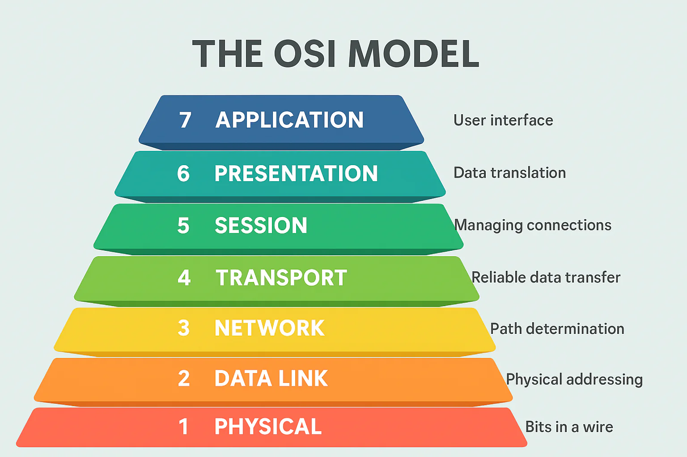

**Introduction to the OSI Model**

The OSI (Open Systems Interconnection) Model is a conceptual framework that standardizes network communication functions into seven distinct layers. It helps ensure interoperability between different systems and technologies

⚙️ Simple Working

When you send a message or file:

Data starts at the top layer (Application) on your device.

Each layer adds its own info (header) — like address, format, encryption, etc.

The data moves down through all 7 layers and is sent through the network.

The receiver’s device goes up the layers, removing info at each step to get the original message.

🧠 Think of it like sending a parcel:

Each department (layer) adds packaging, address, and security.

At the other end, each department unwraps it in reverse order

| Layer No. | Layer Name   | Function                         | Example               |
| --------- | ------------ | -------------------------------- | --------------------- |
| **7**     | Application  | User interaction                 | Email, web browser    |
| **6**     | Presentation | Data format, encryption          | JPEG, SSL             |
| **5**     | Session      | Start, maintain, end connections | Login session         |
| **4**     | Transport    | Reliable delivery, segmentation  | TCP, UDP              |
| **3**     | Network      | Addressing & routing             | IP, routers           |
| **2**     | Data Link    | Error detection, MAC addressing  | Switch, Ethernet      |
| **1**     | Physical     | Actual transmission of bits      | Cables, Wi-Fi signals |

**Tricks**

| P        | D         | N       | T         | S       | P            | A           |
| -------- | --------- | ------- | --------- | ------- | ------------ | ----------- |
| Physical | Data Link | Network | Transport | Session | Presentation | Application |

**Working model**

Layer 1: Physical Layer
The Physical Layer is responsible for the actual transmission of raw data (bits) over a communication medium.

Functions
Defines hardware specifications (e.g., cables, switches, connectors).
Converts digital data into electrical, optical, or radio signals.
Handles data encoding and modulation.
Example
Ethernet cables and Wi-Fi signals operate at the physical layer.

Layer 2: Data Link Layer
The Data Link Layer ensures reliable data transfer between directly connected nodes by organizing raw data into frames.

Functions
Media Access Control (MAC): Manages how devices access the transmission medium.
Error Detection: Identifies and corrects errors in data frames.
Flow Control: Prevents data overflow during transmission.
Example
Switches and MAC addresses work at the data link layer.

Layer 3: Network Layer
The Network Layer is responsible for routing data packets between devices across different networks.

Functions
Logical Addressing: Uses IP addresses to identify devices.
Routing: Determines the best path for data to reach its destination.
Packet Forwarding: Transfers data packets from source to destination.
Example
Routers operate at the network layer and use protocols like IPv4/IPv6.

Layer 4: Transport Layer
The Transport Layer ensures reliable data delivery between devices by managing error correction, flow control, and segmentation.

Functions
Segmentation: Breaks data into smaller segments for transmission.
Error Recovery: Ensures data integrity using acknowledgments and retransmissions.
Port Addressing: Identifies services using port numbers (e.g., HTTP uses port 80).
Protocols
TCP (Transmission Control Protocol): Reliable, connection-oriented protocol.
UDP (User Datagram Protocol): Unreliable, connectionless protocol.
Example
Streaming videos (using UDP) and secure data transfer (using TCP) rely on the transport layer.

Layer 5: Session Layer
The Session Layer establishes, manages, and terminates communication sessions between two devices or applications.

Key Functions
Session Management: Initiates, maintains, and closes sessions.
Synchronization: Implements checkpoints to recover from connection interruptions.
Dialog Control: Manages whether the communication is full-duplex or half-duplex.
Real-Life Analogy
Imagine the Session Layer as a conference call manager who connects participants, ensures they can interact, and closes the call when the discussion ends.

Example
When streaming a video, the Session Layer ensures a continuous session between your device and the streaming server.

Layer 6: Presentation Layer
The Presentation Layer ensures that the data is in a readable and compatible format for both the sender and receiver.

Key Functions
Data Translation: Converts data into a format that both devices understand.
Encryption/Decryption: Secures data by encrypting it before transmission and decrypting it upon receipt.
Compression: Reduces the size of data for faster transmission.
Real-Life Analogy
Think of the Presentation Layer as a translator that converts a message from one language to another, ensuring the receiver understands it.

Example
JPEG, MP4, and GIF formats are handled at this layer. SSL/TLS protocols operate here to secure web communications.

Layer 7: Application Layer
The Application Layer is the closest to the user and directly interacts with software applications to provide network services.

Key Functions
User Interface: Enables interaction between the user and the network.
Service Provision: Provides services like email, file transfer, and remote access.
Data Retrieval: Facilitates data access from a remote database or server.
Real-Life Analogy
The Application Layer is like the interface of an app (e.g., a browser or email client), where users interact without needing to understand the underlying complexities.

Example
HTTP/HTTPS: Used for web browsing.
SMTP/IMAP: Used for email communication.
FTP: Used for file transfer.